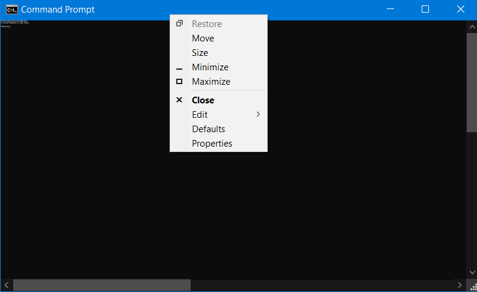
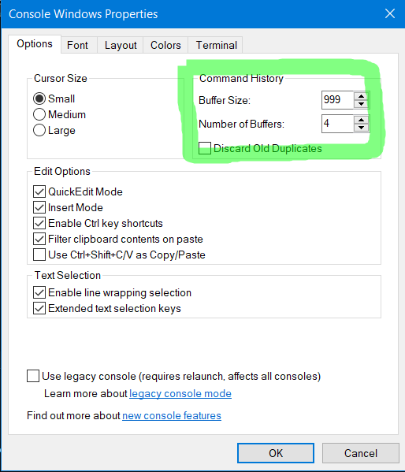
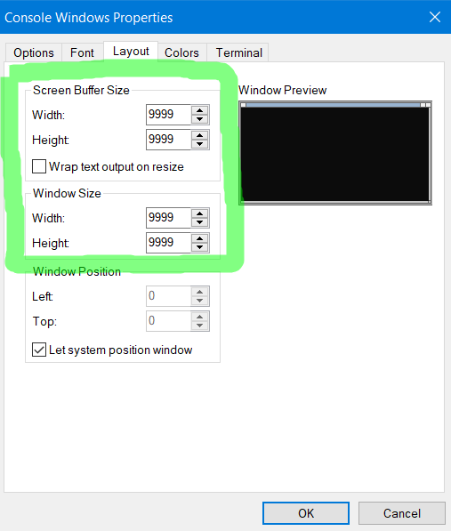
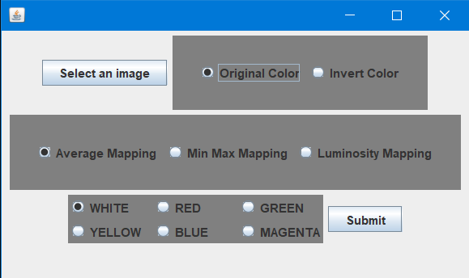

<!-- Improved compatibility of back to top link: See: https://github.com/othneildrew/Best-README-Template/pull/73 -->
<a id="readme-top"></a>


<!-- TABLE OF CONTENTS -->
<details>
  <summary>Table of Contents</summary>
  <ol>
    <li>
      <a href="#about-the-project">About The Project</a>
    </li>
    <li>
      <a href="#getting-started">Getting Started</a>
      <ul>
        <li><a href="#prerequisite">Prerequisite</a></li>
        <li><a href="#installation">Installation</a></li>
      </ul>
    </li>
    <li><a href="#usage">Usage</a></li>
    <li><a href="#contact">Contact</a></li>
    <li><a href="#acknowledgments">Acknowledgments</a></li>
  </ol>
</details>


<!-- ABOUT THE PROJECT -->
## About The Project

As the name suggests the app takes the image, scales down and converts it into an ASCII art which can be viewed in termial.

Here's the full list of features:
* Ability to use different color variants
* Ability to use different brightness mappings (average, min_max, luminosity)
* Ability to use inverted colors


<p align="right">(<a href="#readme-top">back to top</a>)</p>


<!-- GETTING STARTED -->
## Getting Started

To get a local copy up and running follow these simple example steps.


## Prerequisite

Before installing the project make sure that your terminal settings for Screen Buffer size, Window size and Command History Buffer size are maxed out. (In CMD most of these are capped at 9999).
Below are the instructions on how to do this.

Right clikc the CMD window and you will the "defaults" and "properties" sections. You can click either one of them.



Change the Buffer size in Options section.



Change the Screen Buffer size and Window size.



### Installation

Follow the instruction to get the local copy of the app. Use CMD/PowerShell or any other CMD alternative.

1. Clone the repo
   ```sh
   git clone https://github.com/Ferid2003/Photo_to_ASCII_Art.git
   ```
2. Go to cloned repo
   ```sh
   cd Photo_to_ASCII_Art
   ```
3. Compile the maven project
   ```sh
   mvn compile
   ```
4. Execute the maven project
   ```js
   mvn exec:java -Dexec.mainClass=com.farid.Main
   ```
5. Select desired settings in the opened GUI and enjoy :smile:

<p align="right">(<a href="#readme-top">back to top</a>)</p>


<!-- USAGE EXAMPLES -->
## Usage

Below are the screenshots from different parts of application.

### GUI


### Example ASCII art (Image on the right is original)


### Example ASCII art with inverted colors (Image on the right is original)


### Example ASCII art with different colors (Image on the right is original)


<p align="right">(<a href="#readme-top">back to top</a>)</p>


<!-- CONTACT -->
## Contact

Farid Aghazada - feridagazade157@gmail.com

Project Link: [https://github.com/Ferid2003/Photo_to_ASCII_Art](https://github.com/Ferid2003/Photo_to_ASCII_Art)

<p align="right">(<a href="#readme-top">back to top</a>)</p>


<!-- ACKNOWLEDGMENTS -->
## Acknowledgments

* [Robert Heaton](https://robertheaton.com/2018/06/12/programming-projects-for-advanced-beginners-ascii-art/)
* [Jansi](https://fusesource.github.io/jansi/)
* [Best-README-Template](https://github.com/othneildrew/Best-README-Template)

<p align="right">(<a href="#readme-top">back to top</a>)</p>


